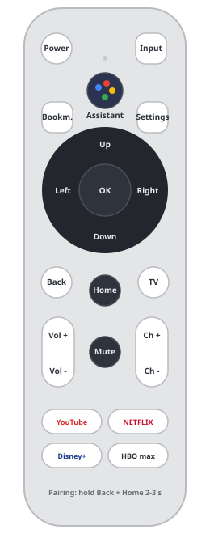

# Onn / Google TV Bluetooth remote on Linux



Pairing, every key code and the built-in **microphone** of the Onn / Google TV Bluetooth remote - decoded and turned into working Python code. Use the remote as a shortcut pad for your desktop or as a **push-to-talk dictation microphone**.

**Documentation website: <https://flomaetschke.github.io/onn-remote-linux/>**

**Get the remote:** <https://amzn.to/4rvycF1> *(affiliate link / advertising - the author may earn a small commission, the price stays the same for you)*

## What works

- Pairing with `bluetoothctl`, automatic reconnect after a key press
- All 22 buttons decoded (table below)
- Microphone: 8 kHz voice audio streamed over BLE (Google's ATVV voice protocol) and decoded from IMA ADPCM
- Dictation into the focused window, D-pad as window focus, Channel +/- as workspace switch (example for Hyprland)

## What does not

- The Linux kernel rejects the remote's HID descriptor (`hid-generic ... item fetching failed at offset 22/23`), so **no `/dev/input` device** is created. The examples read the HID reports directly over GATT with [bleak](https://github.com/hbldh/bleak) - no root, no kernel patch.
- The remote never reports the *release* of the Assistant button - end a recording with OK.
- The voice stream is cut off after ~15 s; the example service re-opens it seamlessly.

## Pairing

1. Put the remote into pairing mode: **hold Back + Home for 2-3 seconds** (the LED usually blinks). Pairing mode does not last long - start the scan first.
2. Pair it:

   ```bash
   bluetoothctl
   [bluetooth]# power on
   [bluetooth]# agent on
   [bluetooth]# default-agent
   [bluetooth]# scan on
   [NEW] Device AA:BB:CC:DD:EE:FF Onn-Remote
   [bluetooth]# pair AA:BB:CC:DD:EE:FF
   [bluetooth]# trust AA:BB:CC:DD:EE:FF
   [bluetooth]# connect AA:BB:CC:DD:EE:FF
   ```

3. Because the device is trusted it reconnects by itself when you press a button. After some idle time it sleeps; the first key press only wakes it.

## Key codes

Each button is an HID report on characteristic `0x2A4D`. Short reports (2 or 4 bytes) carry a 16-bit *Consumer Control* usage in the first two bytes (little endian); the volume keys use an 8-byte keyboard report. A release is an all-zero report sent right after the press.

| Button | Report (hex) | Usage |
|---|---|---|
| Power | `30 00 00 00` | 0x0030 |
| Input | `bb 01 00 00` | 0x01BB |
| Assistant | `21 02` (+ ATVV control `08`) | 0x0221 |
| Bookmark | `2a 02 00 00` | 0x022A |
| Settings (gear) | `96 00 00 00` | 0x0096 |
| D-pad Up / Down / Left / Right | `42` / `43` / `44` / `45` `00 00 00` | 0x0042-0x0045 |
| OK | `41 00 00 00` | 0x0041 |
| Back | `24 02` | 0x0224 |
| Home | `23 02` | 0x0223 |
| TV | `8d 00 00 00` | 0x008D |
| Mute | `e2 00 00 00` | 0x00E2 |
| Channel + / - | `9c` / `9d` `00 00 00` | 0x009C / 0x009D |
| Volume + / - | `00 00 80 00 00 00 00 00` / `00 00 81 00 00 00 00 00` | keyboard key 0x80 / 0x81 |
| YouTube / Netflix / Disney+ / HBO max | `77` / `78` / `79` / `7a` `00 00 00` | 0x0077-0x007A |

## Voice protocol (ATVV) in short

Service `ab5e0001-5a21-4f05-bc7d-af01f617b664`

| Characteristic | Direction | Use |
|---|---|---|
| `ab5e0002-...` | write | commands: `0a 00 04 00 01` GET_CAPS, `0c 00 01` MIC_OPEN, `0d` MIC_CLOSE |
| `ab5e0003-...` | notify | audio frames: 134 bytes (6x20 + 14) = header + 128 bytes IMA ADPCM = 256 samples @ 8 kHz |
| `ab5e0004-...` | notify | control: `08` Assistant pressed, `04` audio start, `0a` sync, `00` audio ended, `0b` caps reply |

Frame layout: `[0:2]` sequence, `[2]` stream id, `[3:5]` predictor (int16 BE), `[5]` step index, `[6:]` ADPCM, high nibble first.

## Code

```bash
git clone https://github.com/FloMaetschke/onn-remote-linux
cd onn-remote-linux
python -m venv .venv && .venv/bin/pip install -r requirements.txt
```

| File | What it does |
|---|---|
| [`examples/atvv.py`](examples/atvv.py) | UUIDs, commands, ADPCM decoder, key table, connection helper |
| [`examples/01_listen_keys.py`](examples/01_listen_keys.py) | live view of every key press |
| [`examples/02_record_voice.py`](examples/02_record_voice.py) | record the remote's microphone to WAV |
| [`examples/03_dictation_service.py`](examples/03_dictation_service.py) | push-to-talk dictation via a virtual PipeWire microphone (+ optional Hyprland control) |
| [`systemd/onn-voice.service`](systemd/onn-voice.service) | user service for the dictation example |

```bash
.venv/bin/python examples/01_listen_keys.py AA:BB:CC:DD:EE:FF
.venv/bin/python examples/02_record_voice.py AA:BB:CC:DD:EE:FF
```

## Troubleshooting

- **`Device ... was not found` from bleak** - the sleeping remote is not in bleak's scan cache. Connect through BlueZ's object path (`atvv.device()` does that).
- **Key presses stop arriving after restarting your program** - `bluetoothctl disconnect <addr>`, restart the program, press a button. Sending MIC_CLOSE right after connecting also clears a stuck state.
- **Scan finds nothing at all** - cheap "CSR8510" dongles are often counterfeit Barrot 8041a02 clones that cannot receive advertisements reliably. Use a Realtek RTL8761B adapter (e.g. TP-Link UB500).

Full details: <https://flomaetschke.github.io/onn-remote-linux/>

## License

MIT - see [LICENSE](LICENSE). Independent, unofficial documentation; not affiliated with Google, Walmart or onn.
